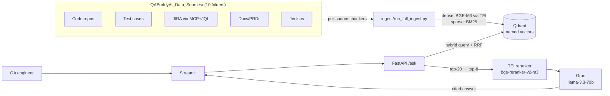

# QABuddyAI — LIVE Hybrid RAG for QA Engineers

Ask one question → get a **cited answer** grounded in the Selenium framework,
Playwright framework, 5,000-test-case repository, JIRA history, PRDs, meeting
notes, Lucidchart flows, and Jenkins results.

Spec: [`QABuddyAI_System_Prompt.md`](QABuddyAI_System_Prompt.md) (master prompt)
and [`prompt.md`](prompt.md) (detailed build spec).

## Architecture

📐 **Full write-up:** [`docs/QABuddyAI_Architecture.html`](docs/QABuddyAI_Architecture.html) — layered architecture diagram, a single-`/ask` sequence, technology stack, ingestion &amp; retrieval pipelines, repository layout, step-by-step backend build guide, and the evaluation harness. Rendered to images: [`docs/QABuddyAI_Architecture.png`](docs/QABuddyAI_Architecture.png) (full page) · [`docs/QABuddyAI_Architecture_Diagram.png`](docs/QABuddyAI_Architecture_Diagram.png) (diagram only).



**Stack (fixed by spec):** BGE-M3 embeddings (TEI, CPU) · Qdrant hybrid
search (dense+sparse named vectors, server-side RRF) · bge-reranker-v2-m3
(TEI rerank mode) · Groq `llama-3.3-70b-versatile` · FastAPI · Streamlit ·
docker-compose + nginx.

> **Sparse-side note (intentional deviation):** TEI does not expose BGE-M3's
> learned sparse head, so the sparse leg of the hybrid uses **BM25 via
> fastembed + Qdrant's IDF modifier** (the standard Qdrant hybrid recipe).
> Retrieval quality is equivalent-or-better for exact-match lookups (TC IDs,
> JIRA keys, method names) — which is exactly what the sparse leg is for.
> Set `SPARSE_BACKEND=tei` + `TEI_SPARSE_URL` to swap in a SPLADE model later.

## Layout

```
QABuddyAI_Data_Sources/   10 drop-zone folders — each README is the ingestion contract
common/                   config + TEI/sparse embedding clients
ingest/chunkers/          7 structure-aware chunkers (see table below)
ingest/run_full_ingest.py batch ingestion, content-hash delta, idempotent
ingest/jira_sync.py       JIRA via MCP + JQL (config/jql.txt), state-tracked
ingest/cron_hourly.sh     PHASE 2 hourly auto-ingest — built, NOT enabled
backend/                  hybrid retrieval → rerank → cited generation → /ask
frontend/app.py           Streamlit chat with source filters + citations
eval/                     golden-set harness: hit-rate@k, citation, faithfulness
```

### Chunking contracts

| Source | Rule | Size (tokens) | Overlap |
|---|---|---|---|
| 01/02 code repos | AST split by class/method (tree-sitter; regex fallback) | 300–500 | 0 |
| 03 test cases | 1 CSV/XLSX row = 1 chunk | 150–300 | 0 |
| 04 JIRA | 1 ticket = 1 chunk; comment-thread split past 800, key repeated | ≤800 | 0 |
| 05/09 docs & PRDs | header-first recursive; REQ-IDs → metadata | 500–800 | 15% |
| 07 meetings | speaker/topic turns | 300–500 | 10% |
| 08 Lucidchart | 1 diagram/sub-flow = 1 chunk | 300–600 | 0 |
| 10 Jenkins | 1 build = summary chunk; failures = separate `is_failure` chunks | 300–500 | 0 |

## Run it

### On the droplet (or any Docker host)

```bash
cp .env.example .env          # fill in GROQ_API_KEY (+ JIRA MCP when available)
docker compose up -d --build  # qdrant, tei-embed, tei-rerank, backend, frontend, nginx
# first start: TEI downloads bge-m3 + reranker (~3 GB) — watch:
docker compose logs -f tei-embed

# populate the folders (clone repos, drop testdata.csv, PDFs, logs...), then:
docker compose exec backend python ingest/run_full_ingest.py --source all

# open http://<droplet-ip>/   (UI)   |   http://<droplet-ip>/api/health
```

Droplet sizing: **8 GB RAM recommended** (two CPU TEI instances ≈ 3–4 GB +
Qdrant + apps). 4 GB will OOM under load.

### Local dev (no Docker for the app)

```bash
python -m venv .venv && .venv\Scripts\activate     # Windows
pip install -r requirements.txt
# run qdrant + the two TEI services via docker, then in .env:
#   QDRANT_URL=http://localhost:6333  TEI_EMBED_URL=http://localhost:8080  TEI_RERANK_URL=http://localhost:8081
uvicorn backend.main:app --reload --port 8000
streamlit run frontend/app.py
```

### Ingestion

```bash
python ingest/run_full_ingest.py --source all            # delta (hash manifest)
python ingest/run_full_ingest.py --source testcases      # one source
python ingest/run_full_ingest.py --source all --full     # ignore manifest
python ingest/jira_sync.py                               # via MCP + config/jql.txt
python ingest/jira_sync.py --delta                       # only updated since last sync
```

Idempotency: point IDs are `uuid5(source_type | source_path | chunk_index)` —
re-running upserts the same points; changed files are deleted first; removed
files have their vectors deleted. Re-running with no changes ingests 0 files.

### Evaluation

Fill `eval/golden_set.jsonl` with 30–50 real QA questions, then:

```bash
python eval/eval.py            # hit-rate@k (fast, free)
python eval/eval.py --judge    # + citation correctness + faithfulness (Groq judge)
```

## Phase 2 — hourly auto-ingest (built, NOT enabled)

`ingest/cron_hourly.sh` does: git pull both repos → JIRA `--delta` sync →
hash-diff scan of all folders. Enable only on go-signal:

```
crontab -e
0 * * * * cd /opt/qabuddy && docker compose exec -T backend bash ingest/cron_hourly.sh >> /var/log/qabuddy_ingest.log 2>&1
```

## Tuning knobs (.env)

| Var | Default | Meaning |
|---|---|---|
| `TOP_N_HYBRID` | 20 | candidates per hybrid leg before rerank |
| `TOP_K_RERANK` | 8 | chunks sent to the LLM |
| `INGEST_BATCH` | 32 | embedding batch size |
| `GROQ_MODEL` | llama-3.3-70b-versatile | answer LLM |
| `SPARSE_BACKEND` | bm25 | sparse leg: `bm25` or `tei` (SPLADE) |

## Still needed from the owner

1. Clone the two repos into folders 01/02; drop `testdata.csv` into 03
2. JIRA MCP connection (`JIRA_MCP_URL`, `JIRA_MCP_TOKEN`) + real JQL in `config/jql.txt`
3. Real golden-set questions in `eval/golden_set.jsonl`
4. Go-signal for Phase 2 cron
